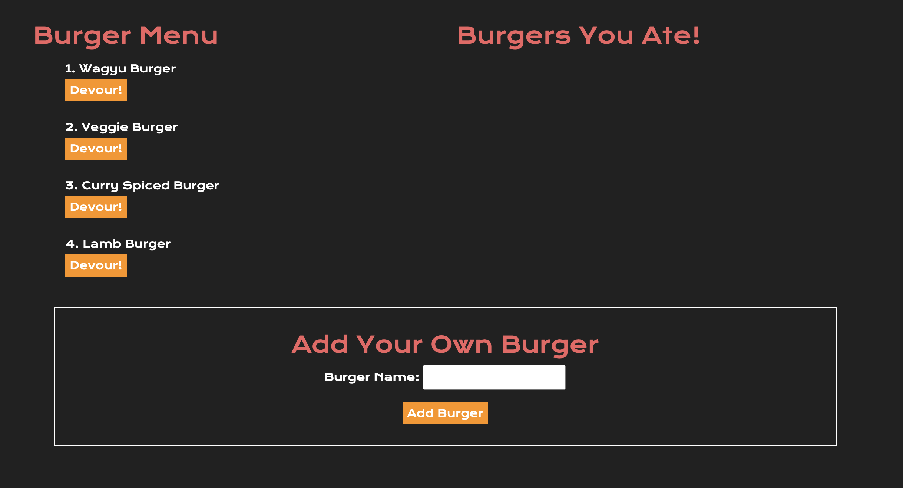

# Burger App

## Description
A burger logger that utilizes MySQL, Node, Express, Handlebars and a homemade ORM. Node and MySQL query and route data and Handlebars generates the page HTML.

## Usage
* Install dependencies.
* Set up a local database via the db folder files. 
* Run within your console.
* View pages via localhost within browser.

## Functionality

